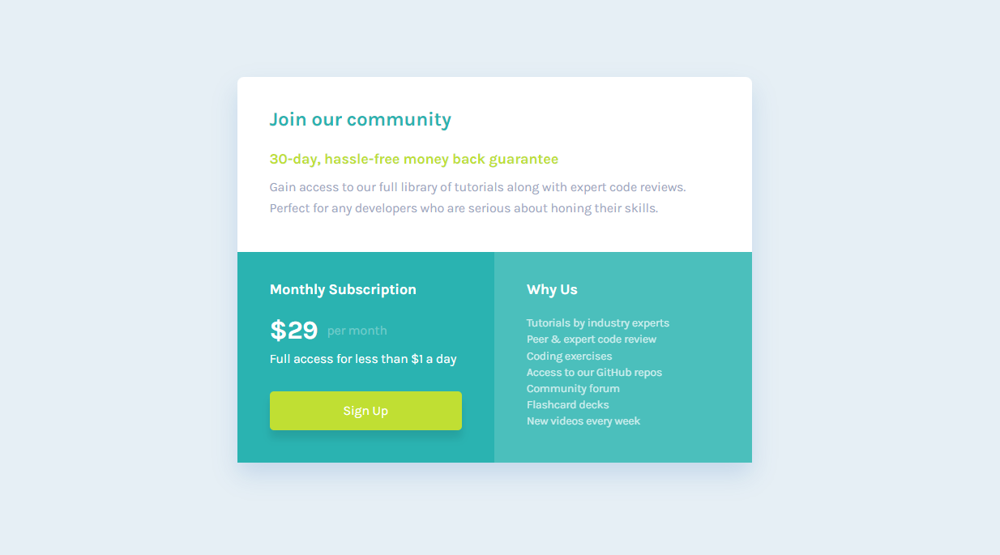

## The challenge

- Develop a page trying to make it as close as possible to the image made by the designer


## Links

- Solution URL: [Add solution URL here](https://your-solution-url.com)
- Live Site URL: [https://single-price-grid-component-master-inky-nine.vercel.app/](https://single-price-grid-component-master-inky-nine.vercel.app/)


## Built with

-  HTML
-  SASS
-  mobile first


## What I learned

I learned how to create fully flexible sizes between two different sizes. Example:
In the original design on 375px screens the container padding is 24px and on 1440px screens it is 40px. Instead of creating a media query to change this I developed an algorithm using the basic css functions like calc, min and max so that in the middle of the way the measure fits. Now when we're on 900px screens automatically the padding goes to 31.435px that's pretty cool. I've used this on fonts and padding, but hope to use it on other things in future projects.
To make my life easier I created a function using SASS to make things easier and reduce code

```
@function flex( $minSize, $maxSize, $mobileWidth: 375, $decktopWidth: 1440) {


     $a: $maxSize * 1px;
     $b: $minSize - $maxSize;
     $c: $decktopWidth - $mobileWidth;
     $d: $minSize * 1px;
     $e: $decktopWidth * 1px;


     @return max(#{$d} , min(#{$a} , calc(#{$a} + #{$b} * ((#{$e} - 100vw) / #{$c})) ))
}
```

## **Resources**

- [An article where I learned how to use min and max](https://ishadeed.com/article/conditional-border-radius/)
- [library hover css](http://ianlunn.github.io/Hover/)

## **Author**

- Frontend Mentor - [@MarlonPassos-git](https://www.frontendmentor.io/profile/MarlonPassos-git)

